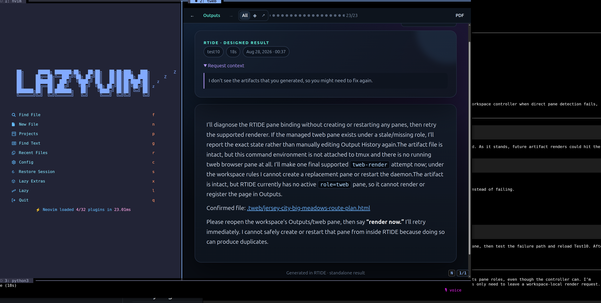

<p align="center">
  
</p>

<h1 align="center">RTIDE — Rich Terminal IDE</h1>

<p align="center"><strong>Keep the speed of the terminal. Get the expressive range of the web.</strong></p>

<p align="center">
  <a href="https://achagani.github.io/rtide/">Website</a> ·
  <a href="#install">Install</a> ·
  <a href="#what-you-get">Features</a>
</p>

<p align="center">
  
</p>

A terminal-based agentic development workspace with a **blended single-tool UI**:
the agent's terminal is the *input* surface, and all substantive output is
channeled through **tweb** as graphically rich HTML.

```
┌──────────────┬──────────────┐
│ nvim (0)  │     tweb (2)     │
│   ~40%    │       ~60%       │
├──────────────┴──────────────┤
│  agent (1) — ~30% strip     │
└─────────────────────────────┘
```

The agent strip is a thin **input box** at the bottom — exactly as tall as its
content (3 lines by default, set with `agent_lines` in `~/.rtide/config`); the
nvim + tweb panes get the rest. It shows a one-line status (`● idle` / `● working 12s · Edit src/app.py` /
`● done (12s)`) and a prompt — type a request, and the harness runs
non-interactively, rendering its response to tweb. Zoom it with `prefix+a` when
you need to work in it. New workspaces start with keyboard focus in this prompt.
While a turn is running, plain text queues a follow-up and the status shows `qN`.
Use `/steer <message>` to interrupt and resume the same session with new direction,
`/interrupt` to stop, `/resend` to repeat the last message, and `/queue` to inspect
the queue count (`/help` prints this reminder in the prompt). Pressing `/` on an
empty prompt opens a selectable command overlay; use Up/Down, Enter, or Escape.
The prompt is a full line editor: Left/Right, Home/End, Ctrl+Left/Ctrl+Right,
and insertion in the middle all work. Press `prefix+v` to dictate locally;
speak, press Enter to stop, and the transcript is inserted at the cursor.

## What you get

- **One workspace per project** — nvim + tweb + agent strip, launched with `rtide <dir>`
- **Forkable by default** — non-Git directories are initialized with a baseline
  commit, enabling isolated conversation forks in globally managed Git worktrees
  and new tmux windows without nesting checkouts inside projects
- **Provider + harness selection** — on every new workspace, RTIDE asks which AI
  provider (anthropic / openai / ollama) and which harness (claude / codex / hermes /
  opencode) to use, filtered to compatible combinations and configured to actually talk
  to the chosen provider (env vars / CLI flags)
- **tweb as the output surface** — the agent renders answers as self-contained HTML
  with the most useful visual form for the content (images, maps, charts, diagrams,
  timelines, tables, and contextual links), with content-led art direction instead
  of a repeated dashboard template; the terminal stays minimal
- **Welcome screen** — each new workspace opens with a branded welcome page in tweb
  (workspace, provider/harness/model, keybindings)
- **Agent as an input box** — the agent pane is a pure input line with a one-line
  status; the harness runs non-interactively per request (`claude -p` / `codex exec` /
  `hermes chat -q` / `opencode run`). Every turn opens as its own designed tweb
  result; a separate visual history index links all prior results and custom artifacts
  through a persistent viewer with clickable position dots and Left/Right arrow navigation.
  Both the archive and viewer can filter All / Artifacts / Responses; the viewer
  offers PDF export, and Actions → Export output PDF saves a clean file directly.
- **Files in the editor** — files the agent creates or edits open in the nvim pane
  via `rtide open <path>` (a convention the agent follows)
- **Agent-independent memory** — one store every agent reads and writes through the
  same interface (`rtide memory`), with an auto-updater that captures `MEM:` lines
- **Hip shell surface** — `:terminal` in nvim opens your configured shell (fish by
  default); `rtide run -- <cmd>` renders program output in the current workspace's tweb pane
- **Multi-tasking** — `prefix+r` jumps between workspaces; `rtide ls` shows the fleet

## Install

```bash
curl -fsSL https://raw.githubusercontent.com/achagani/rtide/main/install.sh | bash
# or, without hosting:
git clone https://github.com/achagani/rtide ~/rtide && ~/rtide/install.sh
# supported host packages are installed by default; this is an explicit equivalent:
curl -fsSL https://raw.githubusercontent.com/achagani/rtide/main/install.sh | bash -s -- --with-deps
# opt out only when intentionally keeping a custom setup:
curl -fsSL https://raw.githubusercontent.com/achagani/rtide/main/install.sh | bash -s -- --without-lazyvim --without-voice
```

The installer builds and tests the source, copies an immutable release under
`~/.local/lib/rtide/versions/`, and atomically activates it through `current`.
`~/.local/bin/rtide` is a stable launcher that also supports rollback. Runtime
configuration and memory remain under `~/.rtide/`. Re-running the same version and
contents is safe; changed contents require a version bump.

Installation also adds a managed `allow-passthrough all` block to your existing
tmux configuration (or creates `~/.tmux.conf`). This lets TWeb send graphics
through tmux to Kitty/Ghostty. Existing settings are preserved and the original
file is backed up as `<config>.rtide-backup`. RTIDE also enables passthrough for
its session on launch, resume, and fork, including with custom tmux configs or
package-manager installs. Package staging itself never edits user configuration.

All output paths share **− / + / Auto** controls: welcome, history, response pages,
custom artifacts, command/stdin output, and implementation dashboards. A controller
bound to the browser pane restores controls after navigation or reload (within
about a second), and exits when that pane closes. In the archive viewer, zoom joins
the existing navigation and scales the content, not the surrounding controls.
Body text is normalized against a 16px baseline so the same percentage means the
same reading size across output types. Auto matches this to terminal line height.
Manual zoom (50–300%) is saved in `.rtide/output-zoom.json` per workspace, with
browser storage bridging immediate navigations. The optional `RTIDE_TWEB_ZOOM`
environment value overrides Auto's calculation. PDF export pauses the controller
and omits interactive controls. Artifact-specific layouts and headings are retained.

**Dependencies** (checked by `rtide doctor`) are grouped into core (`tweb`,
`tmux` ≥ 3.3, `nvim`), terminal (`kitty` or `ghostty`), voice (`pw-record`,
`arecord`, or `rec`, plus local `faster-whisper`), editor configuration
(optional LazyVim), and agents (claude, codex, hermes, or opencode). `--with-deps`
installs the portable host packages for these categories through the first
available package manager (`apt-get`, `dnf`, `brew`, `pacman`, or `zypper`). By
default, `install.sh` bootstraps LazyVim even when Neovim or an existing config
is present; an existing non-LazyVim config is moved to a timestamped
`nvim.rtide-backup.*` directory. It also prepares `~/.rtide/speech-env` without
modifying system Python. Use `--without-lazyvim`, `--without-voice`, or
`--without-deps` only to keep an intentional custom setup.

When `tweb` is missing, the default installer clones
`https://github.com/keyolk/tweb.git` into `~/.local/src/tweb` and runs its
supported `make install` target under `~/.local`; the default host package set
also installs Cargo/Rust and the GTK/ATK/WebKit development libraries because
TWeb builds a Rust workspace against those native libraries. On Linux, the installer
also verifies the corresponding `pkg-config` metadata before it considers the host ready.
Override the source or paths
with `RTIDE_TWEB_SOURCE_URL`, `RTIDE_TWEB_SOURCE_DIR`, and `RTIDE_TWEB_PREFIX`.
Agent CLIs/authentication remain explicit because RTIDE cannot safely choose an
agent or log it in for you. Run `rtide doctor` after bootstrap for the exact
remaining checks.

To remove RTIDE later, run `rtide uninstall`. Add `--purge` to also remove the
global RTIDE config and memory under `~/.rtide`; project workspaces and source
checkouts are preserved. `--yes` skips the confirmation prompt for automation.

## Provider & harness selection

RTIDE is agent-agnostic. On every new-workspace launch it prompts for:

1. **Provider** — `anthropic`, `openai`, or `ollama` (only those with ≥1 installed
   compatible harness are offered)
2. **Harness** — `claude`, `codex`, `hermes`, or `opencode` (only installed + compatible
   with the chosen provider)
3. **Model** — provider-specific list (free text allowed)

The choice is stored per-workspace in `$DIR/.rtide/agent` (overriding the global
config) and the agent pane is launched with the right env vars / flags for the combo.

Pickers use **fzf** when it's installed (fuzzy search, so a long ollama model list
isn't a wall of numbers) and fall back to a numbered list otherwise. The previously
selected provider / harness / model is the default — it's highlighted first, so
pressing Enter keeps it.

### Compatibility matrix

| provider \ harness | claude | codex | hermes | opencode |
|---|---|---|---|---|
| **anthropic** | ✅ | ❌ | ✅ | ✅ |
| **openai** | ❌ | ✅ | ✅ | ✅ |
| **ollama** | ✅ | ✅ | ✅ | ✅ |

- **claude + anthropic** — OAuth (`claude login`) or `ANTHROPIC_API_KEY`
- **claude + ollama** — Ollama's Anthropic-compatible endpoint
  (`ANTHROPIC_BASE_URL=http://127.0.0.1:11434`, `ANTHROPIC_AUTH_TOKEN=ollama`, …)
- **codex + openai** — OAuth (`codex login`) or `OPENAI_API_KEY`
- **codex + ollama** — native `codex --oss --local-provider ollama --model <model>`
- **hermes / opencode** — work with all three providers

`rtide matrix` prints this table; `rtide auth` checks the configured provider is
authenticated; `rtide agent` re-picks provider/harness/model for the current workspace
and restarts its agent pane.

## Usage

```
rtide            → pick a workspace to resume or start one (unknown names only search; type `new` or pick `+ new workspace` to create — first run walks through setup)
rtide <dir>      → launch/attach the workspace for <dir> (prompts for provider/harness/model)
rtide new        → guided new workspace
rtide fork [session] [window] [name] → fork into an isolated Git worktree, agent session, and tweb pane in a new tmux window
rtide fork list|resume|stop|status|memories|migrate|finish [name] → manage persistent feature forks
rtide progress start|checkpoint|complete → publish and continuously rerender the active implementation dashboard
rtide switch     → same picker as bare rtide (resume / new)
rtide ls         → list workspaces
rtide sweep      → capture pending MEM: memories from every live session
rtide quit [dir] → sweep that session's memories, then kill it (from inside or out)
rtide kill [dir] → alias for quit
rtide agent      → re-pick provider/harness/model for the current workspace
rtide permissions unrestricted [dir] → allow the workspace agent to access tmux and the full host filesystem (explicit confirmation required)

`make dev DIR=.` defaults to unrestricted agent access so RTIDE can exercise its real tmux server. Override it with `make dev DIR=. PERMISSION=workspace` (or `observe` / `native`). Normal installed RTIDE remains workspace-sandboxed by default.
rtide config     → view/edit/reset the global config (set key=value, reset [layout|agent|all])
rtide refresh    → apply the global config's layout to a running workspace (prefix+R)
rtide layout-reset [session] → restore nvim 40%, tweb 60%, and the three-line prompt
rtide nvim [toggle|hide|show] [session] → collapse or restore the editor pane
rtide menu       → open the quick-switcher menu for a session (prefix+A)
rtide history    → open the current workspace's browsable output history
rtide pdf [session] [path] → export the complete artifact as an exact-color continuous-page PDF, then reveal it in its folder
rtide auth       → check auth for the configured provider
rtide matrix     → print the provider×harness compatibility matrix
rtide setup      → re-run the wizard
rtide doctor     → verify deps
rtide --no-ask   → skip the provider/harness prompt (use stored config)
```

**In-workspace keybindings** (tmux prefix, default `Ctrl-b`):

```
prefix+t → zoom tweb      (result view)
prefix+a → zoom agent
prefix+r → switch workspace
prefix+R → refresh workspace layout (apply global config to panes)
prefix+e → hide/show the nvim editor while keeping tweb and the prompt visible
prefix+v → dictate; Enter sends the transcript, Shift+Enter inserts it for editing
prefix+A → actions menu (switch / agent / new / fork conversation / refresh / reset layout / hide editor / zoom / config / output history / sweep / quit)
prefix+Q → quit workspace (asks y/n, sweeps memories first)
prefix+z → zoom any pane  (tmux default)
```

Mouse mode is enabled for RTIDE: click a pane to focus it, or drag a pane border
to resize it. The right side of the prompt also has a clickable `🎙 voice` control.

**Applying settings** — layout settings (`agent_lines`, `tweb_pct`, `shell`) live only in
`~/.rtide/config`: the single source of truth, read at launch. `rtide refresh` re-reads it
and applies it to a **running** workspace — no relaunch, nothing materialized per-workspace.
RTIDE also reapplies these dimensions automatically when the terminal is maximized,
restored, or otherwise resized.

| You want to… | Do this |
|---|---|
| Refresh current workspace's layout | `prefix+R` — any pane in the workspace |
| Restore the default pane layout | Actions → Reset pane layout, or `rtide layout-reset` |
| Hide/show the editor | `prefix+e` or Actions → Hide/show editor |
| From a shell inside the workspace | `rtide refresh` (resolves the current session) |
| From outside tmux | `rtide refresh <dir-or-session>` |
| View / change / reset settings | `rtide config` · `rtide config set key=value` · `rtide config reset` |

The provider/harness/model combo stays per-workspace in `.rtide/agent` (`rtide agent`
re-picks it) and is never touched by `rtide refresh`.

`prefix+Q` is the clean way out: it confirms, captures any pending `MEM:` lines
from the agent pane, then kills the session (detaching you back to your shell).
`prefix+d` detaches without quitting — the workspace keeps running.

## Conventions

The agent follows the rules in `AGENTS.md` (seeded per project, never
clobbered): terminal is the input surface (one-line status only), substantive output
is rendered as HTML in tweb, files it creates or edits are opened in the editor pane
via `rtide open <path>`, and durable facts are emitted as `MEM: <slug> — <fact>`
one-liners that the sweep auto-persists to memory.

Implementation work is specified in [`issues/`](issues/README.md). Durable system
boundaries and decisions live in [`docs/architecture/`](docs/architecture/README.md),
while [`docs/roadmap.html`](docs/roadmap.html) is a non-canonical visual index. Local
`rtide progress` dashboards should reference the active issue path rather than repeat
its full specification.

## Layout

Source, installed releases, and runtime state are separate.

```
~/rtide/                  # source (git repo)
├── install.sh
├── bin/rtide             # the only public command
├── libexec/rtide/        # release-private runtime helpers
└── share/AGENTS.md       # convention source
    share/template.html   # report template

~/.local/lib/rtide/
├── current -> versions/0.1.1
└── versions/
    └── 0.1.1/            # immutable tested payload

~/.local/bin/
└── rtide                 # stable launcher + rollback manager

~/.rtide/                 # runtime (created by install.sh, not in git)
├── config                # global provider/harness/model + layout settings
└── memory/               # global memory store
```

Per-project (seeded automatically): `AGENTS.md`, `.tweb/` (gitignored),
`.rtide/agent` (per-workspace provider/harness/model override), `.rtide/memory/`
(committed).

RTIDE-created forks live outside repositories at
`${XDG_DATA_HOME:-~/.local/share}/rtide/worktrees/<repo>-<id>/<fork>`. Set
`RTIDE_WORKTREE_ROOT` for a one-off override or `rtide config set
worktree_root=/absolute/path` for a persistent location. RTIDE rejects a managed
root inside any Git repository. Existing registered worktrees remain where they
are until stopped and moved with `rtide fork migrate <name>`.

### Development workflow

Every implementation issue uses an isolated worktree outside the primary checkout.
Use the issue's stable numeric prefix and slug for the spec, branch, and path:

```bash
cd ~/rtide
mkdir -p ../rtide-worktrees
git worktree add ../rtide-worktrees/NNN-short-slug \
  -b issue/NNN-short-slug main
cd ../rtide-worktrees/NNN-short-slug
git status --short --branch
git worktree list
make dev DIR=.
```

Keep `~/rtide` as the stable release-integration and recovery checkout. Run and
test the editable source from the feature worktree; merge reviewed work back into
`main`, then install from the primary checkout. Remove a finished worktree with
`git worktree remove ../rtide-worktrees/NNN-short-slug` after its branch is merged
and clean, then delete the merged branch with `git branch -d issue/NNN-short-slug`.
Use `-D` only when an accepted squash or equivalent integration prevents Git from
recognizing the branch as merged.

Run editable source without changing the installed release:

```bash
make dev DIR=.
```

Development uses isolated `~/.rtide-dev` configuration and `rtide-dev-*` sessions.
Use `RTIDE_DEV_STATE=shared make dev` only when deliberately testing normal config.

After changing runtime source, bump `VERSION` once and run the full pipeline:

```bash
make install
```

This checks syntax, runs every test, builds a deterministic payload, installs it
under its version, atomically activates it, and verifies the installed version.
`make build` stops after creating `dist/rtide-<version>.tar.gz`.

RTIDE uses the source-controlled semantic version in `VERSION`. Runtime source
changes must include a version bump or the build fails:

```bash
make bump-patch   # 0.1.0 -> 0.1.1
make bump-minor   # 0.1.0 -> 0.2.0
make bump-major   # 0.1.0 -> 1.0.0
rtide --version
```

Reinstalling unchanged source does not increment the version. Use `rtide versions`
to list retained releases and `rtide use <version>` to roll back.

Package maintainers can stage the same payload without user-side effects:

```bash
make stage DESTDIR=/tmp/rtide-package PREFIX=/usr
```

### Output routing

Use `rtide render <file>` or `rtide run -- <command>` from an RTIDE agent or nvim terminal.
The helpers resolve the current tmux session's pane tagged `@rtide-role=tweb`, so
multiple workspaces cannot steal each other's output. They fail clearly if that pane
is missing or duplicated instead of starting a blocking browser in the caller's pane.
Generated command and pipe reports are HTML-escaped and stored under a per-session
cache directory in `~/.cache/rtide/`. Managed pages render one content-size notch
below the browser default (`RTIDE_TWEB_ZOOM=0.9`, overridable in the environment).

Use `rtide open <file>` to open a file in the workspace's nvim pane. It finds the
workspace root (nearest `.rtide/` dir) and talks to nvim over its `--listen` socket
(`.rtide/nvim.sock`), so it works from any subdirectory and any harness.
